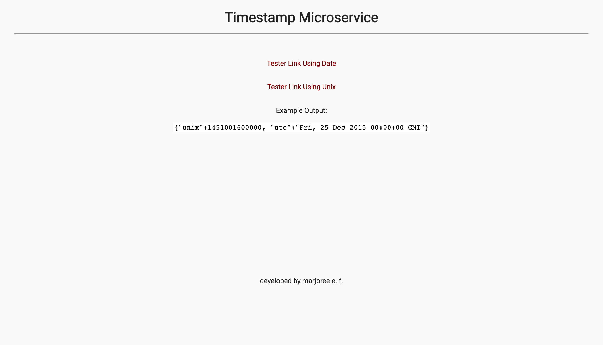

# Timestamp Microservice

Challenge by freeCodeCamp intended to demonstrate backend knowledge on serving various types of data. Primarily developed using JavaScript.


## Table of contents

- [Overview](#overview)
  - [The challenge](#the-challenge)
  - [Screenshot](#screenshot)
  - [Links](#links)
- [My process](#my-process)
  - [Built with](#built-with)
  - [What I learned](#what-i-learned)
  <!-- - [Continued development](#continued-development)
  - [Useful resources](#useful-resources) -->
- [Author](#author)
- [Acknowledgments](#acknowledgments)

## Overview
Build a full stack JavaScript app that is functionally similar to this: [Example](https://timestamp-microservice.freecodecamp.rocks/). Working on this project will involve you writing your code using one of the following methods:

-Clone this GitHub repo and complete your project locally.
-Use our Replit starter project to complete your project.
-Use a site builder of your choice to complete the project. Be sure to incorporate all the files from our GitHub repo.

Note: Time zones conversion is not a purpose of this project, so assume all sent valid dates will be parsed with new Date() as GMT dates.

### The challenge

Users should be able to:

- Make request to /api/:date? with a valid date should return a JSON object with a unix key that is a Unix timestamp of the input date in milliseconds
- Make request to /api/:date? with a valid date should return a JSON object with a utc key that is a string of the input date in the format: Thu, 01 Jan 1970 00:00:00 GMT
- Make request to /api/1451001600000 should return { unix: 1451001600000, utc: "Fri, 25 Dec 2015 00:00:00 GMT" }
-Handle dates that can be successfully parsed by new Date(date_string)
- If the input date string is invalid, the api returns an object having the structure { error : "Invalid Date" }
- An empty date parameter should return the current time in a JSON object with a unix key
- An empty date parameter should return the current time in a JSON object with a utc key

### Screenshot


Result 1

Result 2


### Links

- [Solution URL](https://github.com/mfargas/timestamper.git)
- [Live Site URL](https://margies-timestamper.herokuapp.com/)

## My process

### Built with

- Semantic HTML5 markup
- CSS custom properties
- JavaScript with a Backend Approach
- [Node.js](https://nodejs.org/en/) - JS Runtime
- [Express.js](http://expressjs.com/) - Node.js Framework


### What I learned

This is one of the first projects where I learn to get information using the power of JavaScript computing through the server. 

The app.METHOD and res.json system is easier to understand as the complexity increases with each challenge in this series of backend projects. A simple function like retrieving a date was used to display the proper response.
```
app.get('/api/', (req, res) => {
  res.json({
      
  });
});
```

<!-- ### Continued development

### Useful resources

- [Example resource 1](https://www.example.com) - 
- [Example resource 2](https://www.example.com) -  -->

## Author

- Website - [Marjoree E.F.](https://www.marjoree.com)
- Frontend Mentor - [@mfargas](https://www.frontendmentor.io/profile/mfargas)
- FreeCodeCamp - [@marjoreef](https://www.freecodecamp.org/marjoreef)
- Twitter - [@marjoree_js](https://www.twitter.com/yourusername)

## Acknowledgments

